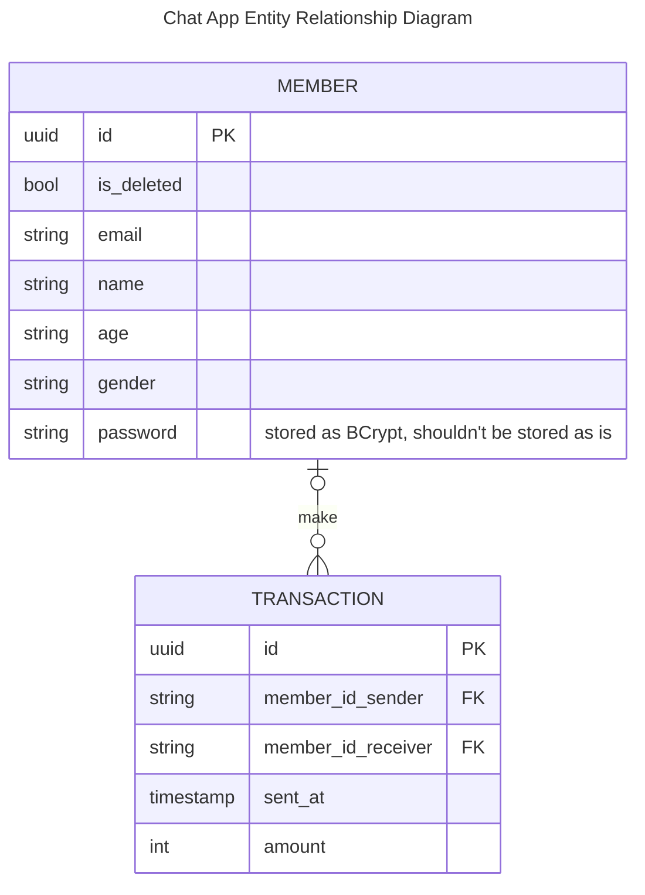

```mermaid
---
title: Chat App Entity Relationship Diagram
---
erDiagram
    MEMBER o|--o{ TRANSACTION : make
    MEMBER {
        uuid id PK
        bool is_deleted
        string email
        string name
        string age
        string gender
        string password "stored as BCrypt, shouldn't be stored as is"
    }
    TRANSACTION {
        uuid id PK
        string member_id_sender FK
        string member_id_receiver FK
        timestamp sent_at
        int amount
    }
```
